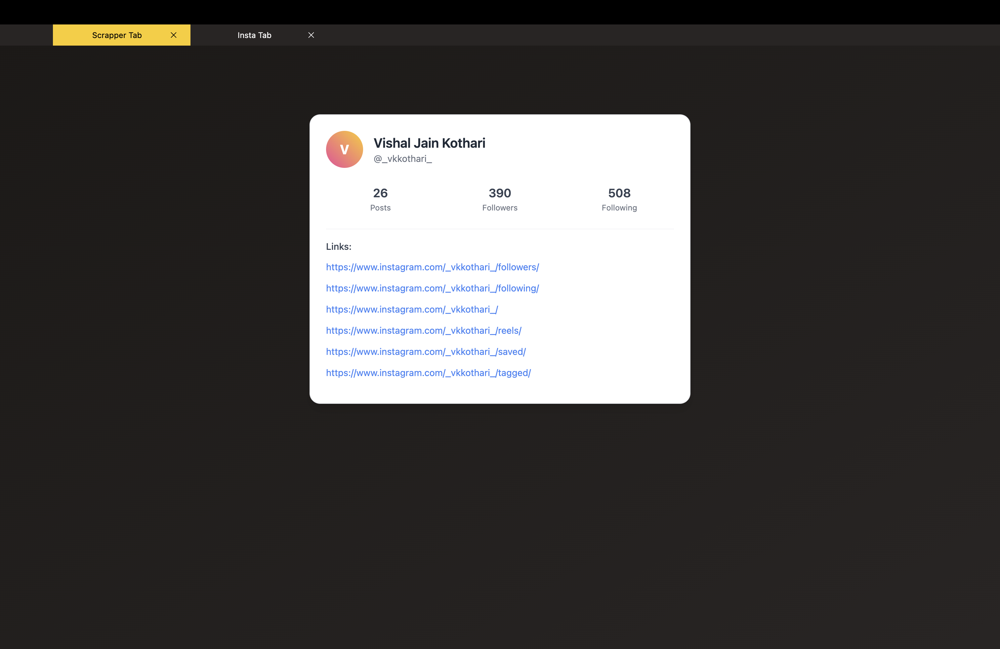

# electron-insta-analytics

Scrapping and visualizing Instagram Data in Electron.

## 📸 Insta Tab Preview

Below is a preview of the Instagram tab integration in our app:



🎥 [Watch the working demo](documentation/running-application.mov)


## Project Setup

### Run Web-Socket FOr quick implmentation and for access to post meta information meat information is a @TODO

```bash
$ cd server
$ npm install
$ npm i -g nodemon
$ nodemon index.js
```

### Run Electron code as below

#### Install

```bash
$ npm install
```

#### Development

```bash
$ npm run dev
```

#### Build

For Electron
```bash
# For windows
$ npm run build:win

# For macOS
$ npm run build:mac

# For Linux
$ npm run build:linux
```

For Websocket
Also we need to host the API's until we complete the store issues

Note -
One will have to launch the application twice because we haven't implemented scenarios covering non logged in

Author
Vishal Kothari